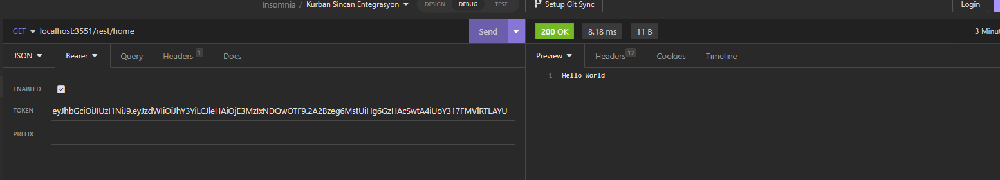
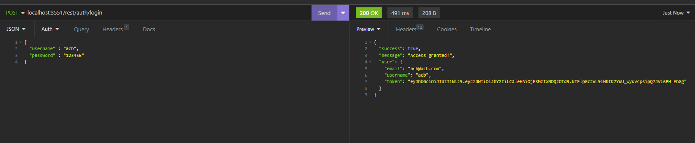

# Getting Started

### Greetings

Hello, I did something. If this is awful or awesome, we'll see :). 

In this project I tried to use Spring Boot framework for the first time. I've created authorization and authentication RESTFul api with jwt token.

Please keep reading and do not hesitate to give feedback to me 

### Reference Documentation
For further reference, please consider the following sections:

* [Official Apache Maven documentation](https://maven.apache.org/guides/index.html)
* [Spring Boot Maven Plugin Reference Guide](https://docs.spring.io/spring-boot/docs/3.2.3/maven-plugin/reference/html/)
* [Create an OCI image](https://docs.spring.io/spring-boot/docs/3.2.3/maven-plugin/reference/html/#build-image)

#### Used Articles 
* [Spring Security JWT Authentication & Authorization](https://medium.com/code-with-farhan/spring-security-jwt-authentication-authorization-a2c6860be3cf) by [Farhan Tanvir](https://medium.com/@fttushar1997)

## How to build 

#### Used IDE : Intellij IDEA 2023.3 Community Edition
#### Dependencies ;
    -spring-boot-starter
    -spring-boot-starter-web
    -spring-boot-starter-security
    -jjwt (0.9.1)

Usually you don't need to do extra any effort to build this project, if you have same IDE mentioned above. However if you don't; clone this repository your favorite folder after that go to main folder of this repo and then open your cmd and type `mvnw spring-boot:run` . 

Congrats you've done; you can open up your favorite API tester app and send HTTP request to `localhost:3551/`. Mine is [Insomnia](https://insomnia.rest/)

In this project default port is `3551`. But you can change it whatever you want under `src/main/resources/application.properties` file.

## End-Points

### Home
url:`localhost:3551/rest/home`

method:`GET`

You must be authorized to access this end-point. If you have authorized and have the access token, follow-up and adjust your insomnia like below:

If you don't, don't worry let's authorize you :) 

### Login
url:`localhost:3551/rest/auth/login`

method:`POST`

body:
`{
    "username" : "acb",
    "password" : "123456"
}`

If you adjusted everything correctly, it should seem like below:

Now you have your token too, you can access Home end-point too.

## Dummy Data

There is no dynamic data manipulation for now. All login credentials hard-coded listed below. In future, there will be more end-points and dynamic data manipulation of course!

- `username : acb, password : 123456` 
- `username : acv, password : 123456v`
- `username : acx, password : 123456x`
- `username : acz, password : 123456z`

Thank you for reading till now.

Do not forget to :star: it :)